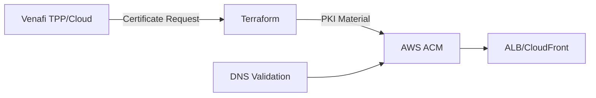

### Expert DevOps Solution: Venafi TLS to AWS ACM with Terraform  
**Objective:** Automate TLS certificate lifecycle (request, issuance, import) using Venafi & AWS ACM with zero manual steps.  

---

#### **1. Architecture Overview**  


---

#### **2. Terraform Configuration**  
**File Structure:**  
```
├── venafi-acm/
│   ├── main.tf
│   ├── variables.tf
│   ├── outputs.tf
│   └── venafi-role.tf (optional IAM)
```

##### **main.tf**  
```hcl
terraform {
  required_version = ">= 1.5.0"
  required_providers {
    venafi = {
      source  = "venafi/vcert"
      version = ">= 0.13.0" # Supports modern Venafi features
    }
    aws = {
      source  = "hashicorp/aws"
      version = ">= 5.30.0"
    }
  }
}

# Venafi Provider (TPP Example)
provider "venafi" {
  url          = var.venafi_url
  access_token = var.venafi_access_token
  tpp_zone     = var.venafi_policy_zone
  trust_bundle = file("${path.module}/tpp-ca.pem") # TPP CA for verification
}

# AWS Provider
provider "aws" {
  region = var.aws_region
  assume_role {
    role_arn = "arn:aws:iam::${var.aws_account_id}:role/VenafiACMRole" # Least privilege role
  }
}

# Generate RSA Key Pair (AWS requires unencrypted private keys)
resource "tls_private_key" "cert_key" {
  algorithm = "RSA"
  rsa_bits  = 2048
}

# Request Venafi Certificate
resource "venafi_certificate" "acm_cert" {
  common_name = var.domain_name
  san_dns     = var.subject_alternative_names
  algorithm   = "RSA"
  rsa_bits    = 2048
  key_password = null # Critical: AWS rejects encrypted keys
  private_key_pem = tls_private_key.cert_key.private_key_pem # Inject generated key

  csr_origin = "service-generated" # Force Venafi to use our key
  expiration_window = 72 # Renew 72h before expiry
}

# Import to AWS ACM
resource "aws_acm_certificate" "imported" {
  private_key       = venafi_certificate.acm_cert.private_key_pem
  certificate_body  = venafi_certificate.acm_cert.certificate
  certificate_chain = venafi_certificate.acm_cert.chain

  lifecycle {
    ignore_changes = [tags, options] # Prevent ACM-managed changes
  }
}

# Trigger DNS Validation (if required)
resource "aws_acm_certificate_validation" "dns" {
  count                   = var.enable_dns_validation ? 1 : 0
  certificate_arn         = aws_acm_certificate.imported.arn
  validation_record_fqdns = [for record in aws_route53_record.validation : record.fqdn]
}
```

##### **variables.tf**  
```hcl
variable "venafi_url" {
  description = "Venafi TPP/Cloud URL (e.g., 'https://tpp.example.com')"
  type        = string
  sensitive   = true
}

variable "venafi_access_token" {
  description = "Venafi TPP access token or VaaS API key"
  type        = string
  sensitive   = true
}

variable "venafi_policy_zone" {
  description = "Policy zone path (e.g., 'Business\\Cloud\\AWS')"
  type        = string
}

variable "aws_region" {
  description = "AWS region for ACM"
  type        = string
  default     = "us-east-1"
}

variable "domain_name" {
  description = "Primary domain name (e.g., 'app.example.com')"
  type        = string
}

variable "subject_alternative_names" {
  description = "List of SAN domains"
  type        = list(string)
  default     = []
}

variable "enable_dns_validation" {
  description = "Enable DNS validation via Route53"
  type        = bool
  default     = false
}
```

##### **outputs.tf**  
```hcl
output "acm_certificate_arn" {
  description = "Imported ACM certificate ARN"
  value       = aws_acm_certificate.imported.arn
  sensitive   = true
}

output "certificate_status" {
  description = "Venafi certificate status"
  value       = venafi_certificate.acm_cert.status
}
```

---

#### **3. IAM Configuration (venafi-role.tf)**  
```hcl
# IAM Role for Venafi Automation
resource "aws_iam_role" "venafi_acm" {
  name = "VenafiACMRole"
  assume_role_policy = jsonencode({
    Version = "2012-10-17"
    Statement = [
      {
        Action = "sts:AssumeRole"
        Effect = "Allow"
        Principal = {
          AWS = "arn:aws:iam::${var.aws_account_id}:root"
        }
      }
    ]
  })
}

# Least Privilege Policy
resource "aws_iam_policy" "acm_import" {
  name        = "ACMImportPolicy"
  description = "Permissions for ACM certificate import"
  
  policy = jsonencode({
    Version = "2012-10-17"
    Statement = [
      {
        Action   = ["acm:ImportCertificate"]
        Effect   = "Allow"
        Resource = "*"
      },
      {
        Action   = ["acm:ListCertificates"]
        Effect   = "Allow"
        Resource = "*"
      }
    ]
  })
}

resource "aws_iam_role_policy_attachment" "venafi_acm" {
  role       = aws_iam_role.venafi_acm.name
  policy_arn = aws_iam_policy.acm_import.arn
}
```

---

#### **4. Deployment Workflow**  
```bash
# Initialize
terraform init -backend-config="bucket=my-tf-state" -backend-config="key=venafi-acm/terraform.tfstate"

# Plan with variables
terraform plan -var="venafi_url=https://tpp.example.com" \
              -var="venafi_access_token=$ENV:VENAFI_TOKEN" \
              -var="domain_name=prod.example.com"

# Apply
terraform apply -auto-approve

# Verify ACM
aws acm describe-certificate --certificate-arn $(terraform output -raw acm_certificate_arn)
```

---

#### **5. Expert Practices**  
1. **Key Security:**  
   - Use Terraform Cloud/Enterprise with encryption for state files  
   - Inject secrets via environment variables or Vault  
   ```hcl
   # Example: Using AWS Secrets Manager  
   data "aws_secretsmanager_secret_version" "venafi_token" {  
     secret_id = "venafi/access_token"  
   }  
   ```
   
2. **Certificate Rotation:**  
   - Set `expiration_window = 168` (renew 7 days before expiry)  
   - Use Terraform Cloud scheduled runs for automated renewals  

3. **DNS Validation Automation:**  
   ```hcl
   # Route53 Validation Records
   resource "aws_route53_record" "validation" {
     for_each = {
       for dvo in aws_acm_certificate.imported.domain_validation_options : dvo.domain_name => {
         name   = dvo.resource_record_name
         record = dvo.resource_record_value
         type   = dvo.resource_record_type
       }
     }

     zone_id = var.route53_zone_id
     name    = each.value.name
     type    = each.value.type
     records = [each.value.record]
     ttl     = 300
   }
   ```

4. **DR Strategy:**  
   - Store Venafi-issued certificates in AWS S3 (encrypted)  
   - Use ACM API for manual import if Terraform fails:  
     ```bash
     aws acm import-certificate \
       --certificate file://cert.pem \
       --private-key file://key.pem \
       --certificate-chain file://chain.pem
     ```

---

#### **6. Troubleshooting Matrix**  
| Issue                          | Resolution |  
|--------------------------------|------------|  
| `InvalidKey: Key is encrypted` | Ensure `key_password = null` |  
| Venafi policy denies request   | Check zone write permissions |  
| ACM import format errors       | Use `openssl` to validate PEM structure |  
| Terraform state drift          | Use `terraform refresh` + versioned state |  

This solution provides enterprise-grade certificate automation with full lifecycle management, adhering to DevOps and security best practices.