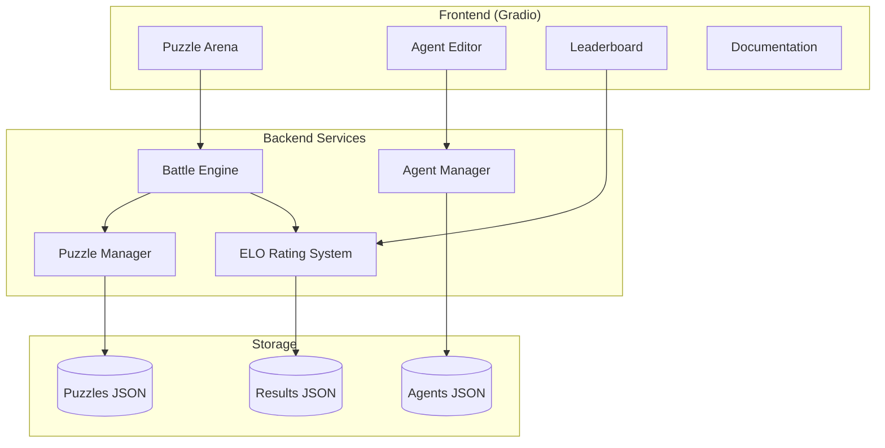

Agentic Lab: A Gamified Learning Platform

Overview

Agentic Lab is a gamified learning platform where users create and battle AI agents against each other to solve logic puzzles. The platform is designed to be hosted on Hugging Face Spaces and includes a Gradio-based web interface, a puzzle library, agent management, a leaderboard system, and a safe code execution environment. This document provides a complete, step-by-step guide to building, deploying, and extending the platform, along with the full codebase.

Table of Contents

1. System Architecture
2. Project Structure
3. Core Components
4. Implementation Details
5. Deployment to Hugging Face Spaces
6. Customization and Extension
7. Full Codebase

System Architecture

The platform consists of the following layers:



The frontend is built with Gradio, providing a simple, interactive UI suitable for Hugging Face Spaces. The backend handles puzzle management, agent execution, and battle simulation. Data is stored in JSON files for simplicity and ease of deployment.

Project Structure

```
agentic-lab/
├── app.py                 # Main Gradio application
├── requirements.txt       # Python dependencies
├── packages.txt           # System dependencies (for Hugging Face Spaces)
├── README.md              # Project documentation
├── .gitignore             # Git ignore rules
├── config/
│   └── settings.py        # Configuration settings
├── core/
│   ├── __init__.py
│   ├── puzzle_manager.py  # Puzzle loading and management
│   ├── agent_manager.py   # Agent loading and management
│   ├── battle_engine.py   # Battle simulation logic
│   ├── elo_system.py      # ELO rating calculations
│   └── sandbox.py         # Safe code execution
├── data/
│   ├── puzzles.json       # Puzzle definitions
│   ├── agents.json        # User-created agents
│   └── results.json       # Match history and ratings
├── utils/
│   ├── __init__.py
│   └── helpers.py         # Helper functions
└── static/
    └── examples/          # Example agent code snippets
```

Core Components

1. Puzzle Manager (core/puzzle_manager.py)

Manages the library of logic puzzles. Each puzzle is defined by:

· ID: Unique identifier
· Name: Display name
· Description: Problem statement
· Test Cases: Input/output pairs for validation
· Difficulty: Beginner, Intermediate, Advanced
· Solution Template: Starter code for agents

2. Agent Manager (core/agent_manager.py)

Handles user-created agents. Each agent consists of:

· ID: Unique identifier
· Name: Agent name
· Author: User identifier
· Code: Python code implementing the solve function
· Created At: Timestamp
· ELO Rating: Current skill rating

3. Battle Engine (core/battle_engine.py)

Simulates matches between agents. The process:

1. Load two agents and a selected puzzle
2. Execute each agent's solve function against the puzzle's test cases
3. Determine the winner based on:
   · Number of correct test cases
   · Execution time
   · Code efficiency
4. Update ELO ratings

4. ELO Rating System (core/elo_system.py)

Implements the ELO rating system used in chess and competitive gaming. Starting rating is 1200. Ratings update based on:

· Expected outcome (calculated from current ratings)
· Actual outcome (win/loss/draw)
· K-factor (determines maximum rating change)

5. Sandbox (core/sandbox.py)

Provides safe execution of user-submitted code. Uses RestrictedPython to:

· Limit available built-ins
· Prevent file system access
· Disable network operations
· Enforce execution time limits

Implementation Details

Puzzle Format (data/puzzles.json)

```json
[
  {
    "id": "fizzbuzz",
    "name": "FizzBuzz",
    "description": "Write a function that returns 'Fizz' for multiples of 3, 'Buzz' for multiples of 5, and 'FizzBuzz' for multiples of both.",
    "test_cases": [
      {"input": 1, "expected": "1"},
      {"input": 3, "expected": "Fizz"},
      {"input": 5, "expected": "Buzz"},
      {"input": 15, "expected": "FizzBuzz"}
    ],
    "difficulty": "beginner",
    "template": "def solve(n):\n    # Your code here\n    pass"
  }
]
```

Agent Code Format

Users submit Python code containing a solve function:

```python
def solve(input_data):
    # input_data will be one of the test case inputs
    # Return your answer
    pass
```

Battle Simulation Flow

1. User selects two agents and a puzzle from the Arena tab
2. Click "Start Battle" triggers the simulation
3. Each agent runs against all test cases
4. Scores are calculated:
   · 1 point per correct test case
   · Bonus points for faster execution (normalized)
5. Winner is determined by total score
6. ELO ratings are updated
7. Results are displayed and stored

Security Considerations

· Code Isolation: RestrictedPython limits dangerous operations
· Timeout: Execution is limited to 5 seconds per test case
· Resource Limits: Memory usage is monitored
· Input Validation: All inputs are sanitized

Deployment to Hugging Face Spaces

Step 1: Create a Hugging Face Account

If you don't have one, sign up at huggingface.co.

Step 2: Create a New Space

1. Click on your profile picture → "New Space"
2. Fill in:
   · Space Name: agentic-lab (or your preferred name)
   · License: MIT (or your choice)
   · SDK: Gradio
   · Hardware: CPU basic (free tier is sufficient)
3. Click "Create Space"

Step 3: Clone the Space Repository

```bash
git clone https://huggingface.co/spaces/YOUR_USERNAME/agentic-lab
cd agentic-lab
```

Step 4: Add the Project Files

Copy all files from the "Full Codebase" section into the cloned repository.

Step 5: Push to Hugging Face

```bash
git add .
git commit -m "Initial commit: Agentic Lab platform"
git push origin main
```

Hugging Face will automatically build and deploy the application. After a few minutes, your app will be live at https://huggingface.co/spaces/YOUR_USERNAME/agentic-lab.

Required Files for Deployment

requirements.txt:

```
gradio>=4.0.0
RestrictedPython>=6.0
pandas
numpy
```

packages.txt (if needed for system dependencies, often empty):

```
# No system packages needed
```

README.md:

```markdown
# Agentic Lab

A gamified learning platform where you can create AI agents and battle them against others to solve logic puzzles.

## Features
- Create and edit agents with custom Python code
- Battle agents against each other in logic puzzle arenas
- Track performance with an ELO rating system
- Built-in puzzle library with varying difficulty levels

## How to Use
1. Go to the "Agent Editor" tab to create your first agent
2. Write a Python function that solves the given problem
3. Go to the "Arena" tab, select two agents and a puzzle, and start the battle
4. Check the "Leaderboard" to see how your agents rank

## Example Agent (FizzBuzz)
```python
def solve(n):
    if n % 15 == 0:
        return "FizzBuzz"
    elif n % 3 == 0:
        return "Fizz"
    elif n % 5 == 0:
        return "Buzz"
    return str(n)
```

```

## Customization and Extension

### Adding New Puzzles

Edit `data/puzzles.json` and add new puzzle entries following the format described above.

### Modifying the ELO System

Adjust the `K_FACTOR` and `DEFAULT_ELO` constants in `core/elo_system.py` to change how ratings are calculated.

### Adding More Test Cases

For each puzzle in `data/puzzles.json`, add additional test cases to make battles more comprehensive.

### Implementing Real-Time Battles

To enable real-time battles (agents making sequential decisions), extend `BattleEngine` to support interactive puzzles.

### Integrating LLM-based Agents

You can modify the sandbox to allow agents to call external LLM APIs (with appropriate rate limiting and cost controls).

## Full Codebase

Below is the complete code for the Agentic Lab platform. Each file is listed with its full contents.

### `app.py`

```python
import gradio as gr
import json
import os
import pandas as pd
from datetime import datetime
from core.puzzle_manager import PuzzleManager
from core.agent_manager import AgentManager
from core.battle_engine import BattleEngine
from core.elo_system import EloSystem

# Initialize components
puzzle_manager = PuzzleManager()
agent_manager = AgentManager()
elo_system = EloSystem()
battle_engine = BattleEngine(puzzle_manager, agent_manager, elo_system)

# Define the Gradio interface
with gr.Blocks(title="Agentic Lab", theme=gr.themes.Soft()) as demo:
    gr.Markdown("""
    # 🧪 Agentic Lab
    ### Create, Train, and Battle AI Agents in Logic Puzzle Arenas
    """)
    
    with gr.Tabs():
        # ---- ARENA TAB ----
        with gr.Tab("⚔️ Arena"):
            with gr.Row():
                with gr.Column(scale=2):
                    gr.Markdown("### Battle Arena")
                    puzzle_dropdown = gr.Dropdown(
                        choices=puzzle_manager.get_puzzle_names(),
                        label="Select Puzzle",
                        value=puzzle_manager.get_puzzle_names()[0] if puzzle_manager.get_puzzle_names() else None
                    )
                    agent1_dropdown = gr.Dropdown(
                        choices=agent_manager.get_agent_names(),
                        label="Agent 1",
                        value=agent_manager.get_agent_names()[0] if agent_manager.get_agent_names() else None
                    )
                    agent2_dropdown = gr.Dropdown(
                        choices=agent_manager.get_agent_names(),
                        label="Agent 2",
                        value=agent_manager.get_agent_names()[1] if len(agent_manager.get_agent_names()) > 1 else None
                    )
                    battle_btn = gr.Button("⚡ Start Battle", variant="primary", size="lg")
                
                with gr.Column(scale=3):
                    gr.Markdown("### Battle Results")
                    result_output = gr.HTML("""
                    <div style="padding: 20px; text-align: center; color: #666;">
                        Select two agents and a puzzle, then click "Start Battle"
                    </div>
                    """)
                    rating_change = gr.HTML(visible=False)
            
            def run_battle(puzzle_name, agent1_name, agent2_name):
                if not all([puzzle_name, agent1_name, agent2_name]):
                    return "<div style='padding:20px;text-align:center;color:#c00;'>Please select both agents and a puzzle.</div>", ""
                
                result = battle_engine.run_battle(puzzle_name, agent1_name, agent2_name)
                
                # Format result HTML
                winner_html = ""
                if result["winner"] == "draw":
                    winner_html = f"<h3 style='color:#f90;'>🤝 Draw!</h3>"
                else:
                    winner_color = "#4CAF50" if result["winner"] == "agent1" else "#2196F3"
                    winner_html = f"<h3 style='color:{winner_color};'>🏆 {result['winner_name']} Wins!</h3>"
                
                result_html = f"""
                <div style="padding: 20px; border-radius: 8px; background: #f5f5f5;">
                    {winner_html}
                    <div style="display: flex; justify-content: space-around; margin: 20px 0;">
                        <div style="text-align: center;">
                            <h4>{result['agent1_name']}</h4>
                            <p style="font-size: 24px; font-weight: bold;">{result['agent1_score']:.1f}</p>
                            <p style="color: #666;">{result['agent1_correct']}/{result['total_cases']} correct</p>
                        </div>
                        <div style="text-align: center;">
                            <h4>{result['agent2_name']}</h4>
                            <p style="font-size: 24px; font-weight: bold;">{result['agent2_score']:.1f}</p>
                            <p style="color: #666;">{result['agent2_correct']}/{result['total_cases']} correct</p>
                        </div>
                    </div>
                    <details style="margin-top: 20px;">
                        <summary>📊 Detailed Results</summary>
                        <pre style="background: #fff; padding: 10px; border-radius: 4px;">{json.dumps(result['details'], indent=2)}</pre>
                    </details>
                </div>
                """
                
                # Format rating change
                rating_html = f"""
                <div style="margin-top: 15px; padding: 15px; background: #e3f2fd; border-radius: 8px;">
                    <h4>📈 ELO Rating Updates</h4>
                    <p><strong>{result['agent1_name']}</strong>: {result['agent1_old_elo']:.0f} → {result['agent1_new_elo']:.0f} ({result['agent1_elo_change']:+.0f})</p>
                    <p><strong>{result['agent2_name']}</strong>: {result['agent2_old_elo']:.0f} → {result['agent2_new_elo']:.0f} ({result['agent2_elo_change']:+.0f})</p>
                </div>
                """
                
                return result_html, rating_html
            
            battle_btn.click(
                run_battle,
                inputs=[puzzle_dropdown, agent1_dropdown, agent2_dropdown],
                outputs=[result_output, rating_change]
            )
        
        # ---- AGENT EDITOR TAB ----
        with gr.Tab("🤖 Agent Editor"):
            with gr.Row():
                with gr.Column(scale=1):
                    gr.Markdown("### Create New Agent")
                    agent_name_input = gr.Textbox(label="Agent Name", placeholder="My Awesome Agent")
                    agent_author_input = gr.Textbox(label="Author", placeholder="Your Name")
                    puzzle_template_dropdown = gr.Dropdown(
                        choices=puzzle_manager.get_puzzle_names(),
                        label="Load Template From Puzzle",
                        value=None
                    )
                    create_agent_btn = gr.Button("✨ Create Agent", variant="primary")
                    
                    gr.Markdown("---")
                    gr.Markdown("### Edit Existing Agent")
                    edit_agent_dropdown = gr.Dropdown(
                        choices=agent_manager.get_agent_names(),
                        label="Select Agent to Edit",
                        value=None
                    )
                    load_agent_btn = gr.Button("📂 Load Agent")
                    delete_agent_btn = gr.Button("🗑️ Delete Agent", variant="stop")
                
                with gr.Column(scale=2):
                    gr.Markdown("### Agent Code")
                    code_editor = gr.Code(
                        label="Python Code",
                        language="python",
                        lines=20,
                        value="# Write your solve function here\ndef solve(input_data):\n    # Your code\n    pass"
                    )
                    with gr.Row():
                        save_agent_btn = gr.Button("💾 Save Agent", variant="primary")
                        test_agent_btn = gr.Button("🧪 Test Agent")
                    
                    test_puzzle_dropdown = gr.Dropdown(
                        choices=puzzle_manager.get_puzzle_names(),
                        label="Test with Puzzle",
                        value=puzzle_manager.get_puzzle_names()[0] if puzzle_manager.get_puzzle_names() else None
                    )
                    test_output = gr.HTML()
            
            def load_template(puzzle_name):
                if puzzle_name:
                    template = puzzle_manager.get_template(puzzle_name)
                    return template
                return "# Write your solve function here\ndef solve(input_data):\n    # Your code\n    pass"
            
            puzzle_template_dropdown.change(
                load_template,
                inputs=[puzzle_template_dropdown],
                outputs=[code_editor]
            )
            
            def create_new_agent(name, author):
                if not name:
                    return gr.update(), gr.update(), "Please enter an agent name."
                agent_id = agent_manager.create_agent(name, author, "")
                agent_manager.save_agents()
                return (
                    gr.update(choices=agent_manager.get_agent_names()),
                    gr.update(choices=agent_manager.get_agent_names()),
                    f"Agent '{name}' created. Now write your code and save."
                )
            
            create_agent_btn.click(
                create_new_agent,
                inputs=[agent_name_input, agent_author_input],
                outputs=[edit_agent_dropdown, agent1_dropdown, gr.Textbox(visible=False)]
            ).then(
                lambda: agent1_dropdown.update(choices=agent_manager.get_agent_names()),
                outputs=[agent1_dropdown]
            )
            
            def load_agent_for_edit(agent_name):
                if not agent_name:
                    return "", ""
                agent = agent_manager.get_agent_by_name(agent_name)
                if agent:
                    return agent["code"], f"Loaded: {agent_name} by {agent['author']}"
                return "", "Agent not found."
            
            load_agent_btn.click(
                load_agent_for_edit,
                inputs=[edit_agent_dropdown],
                outputs=[code_editor, gr.Textbox(label="Status", visible=True)]
            )
            
            def save_agent_code(agent_name, code):
                if not agent_name:
                    return "No agent selected. Create a new agent or select one to edit."
                success = agent_manager.update_agent_code(agent_name, code)
                if success:
                    agent_manager.save_agents()
                    return f"Agent '{agent_name}' saved successfully!"
                return "Failed to save agent."
            
            save_agent_btn.click(
                save_agent_code,
                inputs=[edit_agent_dropdown, code_editor],
                outputs=[gr.Textbox(label="Status", visible=True)]
            )
            
            def delete_agent(agent_name):
                if not agent_name:
                    return gr.update(), gr.update(), "No agent selected."
                success = agent_manager.delete_agent(agent_name)
                if success:
                    agent_manager.save_agents()
                    return (
                        gr.update(choices=agent_manager.get_agent_names()),
                        gr.update(choices=agent_manager.get_agent_names()),
                        f"Agent '{agent_name}' deleted."
                    )
                return gr.update(), gr.update(), "Failed to delete agent."
            
            delete_agent_btn.click(
                delete_agent,
                inputs=[edit_agent_dropdown],
                outputs=[edit_agent_dropdown, agent1_dropdown, gr.Textbox(visible=False)]
            )
            
            def test_agent_code(code, puzzle_name):
                if not code or not puzzle_name:
                    return "<div style='color:red;'>Please provide code and select a puzzle.</div>"
                
                results = battle_engine.test_agent(code, puzzle_name)
                
                if "error" in results:
                    return f"<div style='color:red;'><strong>Error:</strong> {results['error']}</div>"
                
                html = f"""
                <div style="padding: 15px; background: #f5f5f5; border-radius: 8px;">
                    <h4>Test Results for {puzzle_name}</h4>
                    <p>✅ Correct: {results['correct']}/{results['total']}</p>
                    <p>⏱️ Total Time: {results['total_time']:.4f}s</p>
                    <table style="width:100%; border-collapse: collapse;">
                        <tr><th>Input</th><th>Expected</th><th>Got</th><th>Status</th></tr>
                """
                for case in results['cases']:
                    status_color = "green" if case['correct'] else "red"
                    status_text = "✓" if case['correct'] else "✗"
                    html += f"""
                        <tr style="border-bottom:1px solid #ddd;">
                            <td>{case['input']}</td>
                            <td>{case['expected']}</td>
                            <td>{case['got']}</td>
                            <td style="color:{status_color};">{status_text}</td>
                        </tr>
                    """
                html += "</table></div>"
                return html
            
            test_agent_btn.click(
                test_agent_code,
                inputs=[code_editor, test_puzzle_dropdown],
                outputs=[test_output]
            )
        
        # ---- LEADERBOARD TAB ----
        with gr.Tab("🏆 Leaderboard"):
            gr.Markdown("### Agent Rankings (ELO)")
            
            def get_leaderboard():
                agents = agent_manager.get_all_agents()
                if not agents:
                    return pd.DataFrame(columns=["Rank", "Agent", "Author", "ELO", "Battles", "Win Rate"])
                
                sorted_agents = sorted(agents, key=lambda x: x["elo"], reverse=True)
                data = []
                for i, agent in enumerate(sorted_agents, 1):
                    battles = agent.get("battles", 0)
                    wins = agent.get("wins", 0)
                    win_rate = f"{(wins/battles*100):.1f}%" if battles > 0 else "N/A"
                    data.append({
                        "Rank": i,
                        "Agent": agent["name"],
                        "Author": agent["author"],
                        "ELO": f"{agent['elo']:.0f}",
                        "Battles": battles,
                        "Win Rate": win_rate
                    })
                return pd.DataFrame(data)
            
            leaderboard_table = gr.Dataframe(
                value=get_leaderboard(),
                headers=["Rank", "Agent", "Author", "ELO", "Battles", "Win Rate"],
                interactive=False
            )
            
            refresh_leaderboard_btn = gr.Button("🔄 Refresh")
            refresh_leaderboard_btn.click(
                get_leaderboard,
                outputs=[leaderboard_table]
            )
        
        # ---- PUZZLE LIBRARY TAB ----
        with gr.Tab("📚 Puzzle Library"):
            gr.Markdown("### Available Puzzles")
            
            def get_puzzle_list():
                puzzles = puzzle_manager.get_all_puzzles()
                data = []
                for p in puzzles:
                    data.append({
                        "Name": p["name"],
                        "Difficulty": p["difficulty"],
                        "Test Cases": len(p["test_cases"]),
                        "Description": p["description"][:100] + "..." if len(p["description"]) > 100 else p["description"]
                    })
                return pd.DataFrame(data)
            
            puzzle_table = gr.Dataframe(
                value=get_puzzle_list(),
                headers=["Name", "Difficulty", "Test Cases", "Description"],
                interactive=False
            )
            
            selected_puzzle_dropdown = gr.Dropdown(
                choices=puzzle_manager.get_puzzle_names(),
                label="View Puzzle Details",
                value=None
            )
            
            puzzle_details = gr.HTML()
            
            def show_puzzle_details(puzzle_name):
                if not puzzle_name:
                    return ""
                puzzle = puzzle_manager.get_puzzle(puzzle_name)
                if not puzzle:
                    return ""
                
                test_cases_html = ""
                for tc in puzzle["test_cases"]:
                    test_cases_html += f"<tr><td>{tc['input']}</td><td>{tc['expected']}</td></tr>"
                
                return f"""
                <div style="padding: 15px; background: #f5f5f5; border-radius: 8px;">
                    <h3>{puzzle['name']}</h3>
                    <p><strong>Difficulty:</strong> {puzzle['difficulty']}</p>
                    <p>{puzzle['description']}</p>
                    <h4>Test Cases</h4>
                    <table style="width:100%; border-collapse: collapse;">
                        <tr><th>Input</th><th>Expected Output</th></tr>
                        {test_cases_html}
                    </table>
                    <h4>Template</h4>
                    <pre style="background: #fff; padding: 10px; border-radius: 4px;">{puzzle.get('template', '')}</pre>
                </div>
                """
            
            selected_puzzle_dropdown.change(
                show_puzzle_details,
                inputs=[selected_puzzle_dropdown],
                outputs=[puzzle_details]
            )
        
        # ---- DOCUMENTATION TAB ----
        with gr.Tab("📖 Docs"):
            gr.Markdown("""
            # Agentic Lab Documentation
            
            ## Getting Started
            
            ### 1. Create Your First Agent
            1. Go to the **Agent Editor** tab.
            2. Enter an agent name and your name.
            3. Click "Create Agent".
            4. Write your Python code in the editor. Your code must contain a `solve(input_data)` function.
            5. Click "Save Agent".
            
            ### 2. Test Your Agent
            1. In the Agent Editor, select a puzzle from the "Test with Puzzle" dropdown.
            2. Click "Test Agent" to see how your code performs.
            
            ### 3. Battle Other Agents
            1. Go to the **Arena** tab.
            2. Select a puzzle and two agents.
            3. Click "Start Battle" to watch them compete.
            4. Check the **Leaderboard** to see rankings.
            
            ## Writing Agent Code
            
            Your agent must implement a function with the following signature:
            
            ```python
            def solve(input_data):
                # Your logic here
                return result
            ```
            
            The `input_data` will be one of the puzzle's test case inputs. Your function should return the expected output.
            
            ### Example: FizzBuzz
            
            ```python
            def solve(n):
                if n % 15 == 0:
                    return "FizzBuzz"
                elif n % 3 == 0:
                    return "Fizz"
                elif n % 5 == 0:
                    return "Buzz"
                return str(n)
            ```
            
            ## ELO Rating System
            
            Agents start with 1200 ELO. After each battle:
            - The winner gains points from the loser.
            - The amount depends on the rating difference (upsets cause larger changes).
            - Ratings are updated after every battle.
            
            ## Security
            
            Agent code runs in a restricted environment:
            - No file system access
            - No network operations
            - Limited built-in functions
            - 5-second execution timeout per test case
            
            ## Adding New Puzzles
            
            To add new puzzles, edit the `data/puzzles.json` file and restart the application.
            """)

# Launch the app
if __name__ == "__main__":
    demo.launch()
```

core/__init__.py

```python
# Core module initialization
```

core/puzzle_manager.py

```python
import json
import os

class PuzzleManager:
    def __init__(self, puzzles_file="data/puzzles.json"):
        self.puzzles_file = puzzles_file
        self.puzzles = self._load_puzzles()
    
    def _load_puzzles(self):
        """Load puzzles from JSON file."""
        if not os.path.exists(self.puzzles_file):
            # Create default puzzles if file doesn't exist
            default_puzzles = [
                {
                    "id": "fizzbuzz",
                    "name": "FizzBuzz",
                    "description": "Write a function that returns 'Fizz' for multiples of 3, 'Buzz' for multiples of 5, and 'FizzBuzz' for multiples of both. Otherwise return the number as a string.",
                    "test_cases": [
                        {"input": 1, "expected": "1"},
                        {"input": 3, "expected": "Fizz"},
                        {"input": 5, "expected": "Buzz"},
                        {"input": 15, "expected": "FizzBuzz"},
                        {"input": 30, "expected": "FizzBuzz"},
                        {"input": 7, "expected": "7"}
                    ],
                    "difficulty": "beginner",
                    "template": "def solve(n):\n    if n % 15 == 0:\n        return 'FizzBuzz'\n    elif n % 3 == 0:\n        return 'Fizz'\n    elif n % 5 == 0:\n        return 'Buzz'\n    return str(n)"
                },
                {
                    "id": "fibonacci",
                    "name": "Fibonacci",
                    "description": "Return the nth Fibonacci number. The sequence starts with F(0)=0, F(1)=1.",
                    "test_cases": [
                        {"input": 0, "expected": 0},
                        {"input": 1, "expected": 1},
                        {"input": 5, "expected": 5},
                        {"input": 10, "expected": 55},
                        {"input": 15, "expected": 610}
                    ],
                    "difficulty": "beginner",
                    "template": "def solve(n):\n    a, b = 0, 1\n    for _ in range(n):\n        a, b = b, a + b\n    return a"
                },
                {
                    "id": "palindrome",
                    "name": "Palindrome Checker",
                    "description": "Return True if the input string is a palindrome (reads the same forwards and backwards), ignoring case and non-alphanumeric characters.",
                    "test_cases": [
                        {"input": "racecar", "expected": True},
                        {"input": "A man, a plan, a canal: Panama", "expected": True},
                        {"input": "hello", "expected": False},
                        {"input": "12321", "expected": True}
                    ],
                    "difficulty": "intermediate",
                    "template": "def solve(s):\n    # Clean the string\n    cleaned = ''.join(c.lower() for c in s if c.isalnum())\n    return cleaned == cleaned[::-1]"
                },
                {
                    "id": "prime",
                    "name": "Prime Number",
                    "description": "Return True if the input number is prime, False otherwise.",
                    "test_cases": [
                        {"input": 2, "expected": True},
                        {"input": 3, "expected": True},
                        {"input": 4, "expected": False},
                        {"input": 17, "expected": True},
                        {"input": 100, "expected": False}
                    ],
                    "difficulty": "beginner",
                    "template": "def solve(n):\n    if n < 2:\n        return False\n    for i in range(2, int(n**0.5) + 1):\n        if n % i == 0:\n            return False\n    return True"
                }
            ]
            os.makedirs(os.path.dirname(self.puzzles_file), exist_ok=True)
            with open(self.puzzles_file, 'w') as f:
                json.dump(default_puzzles, f, indent=2)
            return default_puzzles
        
        with open(self.puzzles_file, 'r') as f:
            return json.load(f)
    
    def get_all_puzzles(self):
        """Return all puzzles."""
        return self.puzzles
    
    def get_puzzle_names(self):
        """Return list of puzzle names."""
        return [p["name"] for p in self.puzzles]
    
    def get_puzzle(self, name):
        """Get puzzle by name."""
        for p in self.puzzles:
            if p["name"] == name:
                return p
        return None
    
    def get_template(self, name):
        """Get solution template for a puzzle."""
        puzzle = self.get_puzzle(name)
        return puzzle.get("template", "") if puzzle else ""
```

core/agent_manager.py

```python
import json
import os
import uuid
from datetime import datetime

class AgentManager:
    def __init__(self, agents_file="data/agents.json"):
        self.agents_file = agents_file
        self.agents = self._load_agents()
    
    def _load_agents(self):
        """Load agents from JSON file."""
        if not os.path.exists(self.agents_file):
            os.makedirs(os.path.dirname(self.agents_file), exist_ok=True)
            with open(self.agents_file, 'w') as f:
                json.dump([], f)
            return []
        
        with open(self.agents_file, 'r') as f:
            return json.load(f)
    
    def save_agents(self):
        """Save agents to JSON file."""
        with open(self.agents_file, 'w') as f:
            json.dump(self.agents, f, indent=2)
    
    def get_all_agents(self):
        """Return all agents."""
        return self.agents
    
    def get_agent_names(self):
        """Return list of agent names."""
        return [a["name"] for a in self.agents]
    
    def get_agent_by_name(self, name):
        """Get agent by name."""
        for a in self.agents:
            if a["name"] == name:
                return a
        return None
    
    def get_agent_by_id(self, agent_id):
        """Get agent by ID."""
        for a in self.agents:
            if a["id"] == agent_id:
                return a
        return None
    
    def create_agent(self, name, author, code=""):
        """Create a new agent."""
        agent_id = str(uuid.uuid4())[:8]
        agent = {
            "id": agent_id,
            "name": name,
            "author": author,
            "code": code,
            "created_at": datetime.now().isoformat(),
            "elo": 1200,
            "battles": 0,
            "wins": 0,
            "losses": 0,
            "draws": 0
        }
        self.agents.append(agent)
        self.save_agents()
        return agent_id
    
    def update_agent_code(self, name, code):
        """Update agent's code."""
        for agent in self.agents:
            if agent["name"] == name:
                agent["code"] = code
                return True
        return False
    
    def update_agent_stats(self, name, elo_change, result):
        """Update agent's battle statistics."""
        for agent in self.agents:
            if agent["name"] == name:
                agent["elo"] += elo_change
                agent["battles"] += 1
                if result == "win":
                    agent["wins"] += 1
                elif result == "loss":
                    agent["losses"] += 1
                else:
                    agent["draws"] += 1
                return True
        return False
    
    def delete_agent(self, name):
        """Delete an agent."""
        for i, agent in enumerate(self.agents):
            if agent["name"] == name:
                del self.agents[i]
                return True
        return False
```

core/battle_engine.py

```python
import time
import traceback
from core.sandbox import Sandbox
from core.elo_system import EloSystem

class BattleEngine:
    def __init__(self, puzzle_manager, agent_manager, elo_system):
        self.puzzle_manager = puzzle_manager
        self.agent_manager = agent_manager
        self.elo_system = elo_system
        self.sandbox = Sandbox()
    
    def test_agent(self, code, puzzle_name):
        """Test a single agent against a puzzle."""
        puzzle = self.puzzle_manager.get_puzzle(puzzle_name)
        if not puzzle:
            return {"error": "Puzzle not found"}
        
        return self.sandbox.run_tests(code, puzzle["test_cases"])
    
    def run_battle(self, puzzle_name, agent1_name, agent2_name):
        """Run a battle between two agents."""
        puzzle = self.puzzle_manager.get_puzzle(puzzle_name)
        agent1 = self.agent_manager.get_agent_by_name(agent1_name)
        agent2 = self.agent_manager.get_agent_by_name(agent2_name)
        
        if not all([puzzle, agent1, agent2]):
            return {"error": "Invalid puzzle or agents"}
        
        # Run tests for both agents
        results1 = self.sandbox.run_tests(agent1["code"], puzzle["test_cases"])
        results2 = self.sandbox.run_tests(agent2["code"], puzzle["test_cases"])
        
        # Calculate scores
        score1 = self._calculate_score(results1)
        score2 = self._calculate_score(results2)
        
        # Determine winner
        if score1 > score2:
            winner = "agent1"
            winner_name = agent1_name
            loser_name = agent2_name
            winner_result = "win"
            loser_result = "loss"
        elif score2 > score1:
            winner = "agent2"
            winner_name = agent2_name
            loser_name = agent1_name
            winner_result = "win"
            loser_result = "loss"
        else:
            winner = "draw"
            winner_name = "Draw"
            loser_name = "Draw"
            winner_result = "draw"
            loser_result = "draw"
        
        # Calculate ELO changes
        if winner != "draw":
            elo_change = self.elo_system.calculate_elo_change(
                agent1["elo"] if winner == "agent1" else agent2["elo"],
                agent2["elo"] if winner == "agent1" else agent1["elo"],
                winner_result
            )
        else:
            elo_change = self.elo_system.calculate_elo_change(
                agent1["elo"], agent2["elo"], "draw"
            )
        
        # Update agent stats
        if winner == "agent1":
            self.agent_manager.update_agent_stats(agent1_name, elo_change, "win")
            self.agent_manager.update_agent_stats(agent2_name, -elo_change, "loss")
            agent1_old_elo = agent1["elo"]
            agent2_old_elo = agent2["elo"]
            agent1_new_elo = agent1_old_elo + elo_change
            agent2_new_elo = agent2_old_elo - elo_change
        elif winner == "agent2":
            self.agent_manager.update_agent_stats(agent2_name, elo_change, "win")
            self.agent_manager.update_agent_stats(agent1_name, -elo_change, "loss")
            agent1_old_elo = agent1["elo"]
            agent2_old_elo = agent2["elo"]
            agent1_new_elo = agent1_old_elo - elo_change
            agent2_new_elo = agent2_old_elo + elo_change
        else:
            # Draw: smaller ELO exchange
            draw_elo_change = self.elo_system.calculate_elo_change(
                agent1["elo"], agent2["elo"], "draw"
            )
            self.agent_manager.update_agent_stats(agent1_name, draw_elo_change, "draw")
            self.agent_manager.update_agent_stats(agent2_name, -draw_elo_change, "draw")
            agent1_old_elo = agent1["elo"]
            agent2_old_elo = agent2["elo"]
            agent1_new_elo = agent1_old_elo + draw_elo_change
            agent2_new_elo = agent2_old_elo - draw_elo_change
            elo_change = draw_elo_change
        
        self.agent_manager.save_agents()
        
        return {
            "agent1_name": agent1_name,
            "agent2_name": agent2_name,
            "agent1_score": score1,
            "agent2_score": score2,
            "agent1_correct": results1["correct"],
            "agent2_correct": results2["correct"],
            "total_cases": len(puzzle["test_cases"]),
            "winner": winner,
            "winner_name": winner_name,
            "agent1_old_elo": agent1_old_elo,
            "agent1_new_elo": agent1_new_elo,
            "agent1_elo_change": agent1_new_elo - agent1_old_elo,
            "agent2_old_elo": agent2_old_elo,
            "agent2_new_elo": agent2_new_elo,
            "agent2_elo_change": agent2_new_elo - agent2_old_elo,
            "details": {
                "agent1_results": results1,
                "agent2_results": results2
            }
        }
    
    def _calculate_score(self, results):
        """Calculate a score from test results."""
        if "error" in results:
            return 0
        
        base_score = results["correct"] * 10  # 10 points per correct answer
        
        # Bonus for speed (normalized)
        time_bonus = max(0, 10 - results["total_time"] * 10)
        
        return base_score + time_bonus
```

core/elo_system.py

```python
import math

class EloSystem:
    def __init__(self, default_elo=1200, k_factor=32):
        self.default_elo = default_elo
        self.k_factor = k_factor
    
    def calculate_expected_score(self, rating_a, rating_b):
        """Calculate expected score for player A against player B."""
        return 1 / (1 + 10 ** ((rating_b - rating_a) / 400))
    
    def calculate_elo_change(self, rating_a, rating_b, result, k_factor=None):
        """
        Calculate ELO change for player A.
        
        Args:
            rating_a: Current ELO of player A
            rating_b: Current ELO of player B
            result: 1 for win, 0.5 for draw, 0 for loss
            k_factor: Optional override for K-factor
        
        Returns:
            ELO change for player A (positive for gain, negative for loss)
        """
        k = k_factor if k_factor is not None else self.k_factor
        expected = self.calculate_expected_score(rating_a, rating_b)
        
        if result == "win":
            actual = 1.0
        elif result == "draw":
            actual = 0.5
        else:  # loss
            actual = 0.0
        
        return k * (actual - expected)
    
    def update_ratings(self, rating_a, rating_b, result):
        """Update both ratings and return new values."""
        change_a = self.calculate_elo_change(rating_a, rating_b, result)
        new_a = rating_a + change_a
        new_b = rating_b - change_a
        return new_a, new_b, change_a
```

core/sandbox.py

```python
import sys
import io
import time
import traceback
from RestrictedPython import compile_restricted, safe_builtins
from RestrictedPython.Eval import default_guarded_getitem
from RestrictedPython.Guards import guarded_iter_unpack_sequence

class Sandbox:
    """Safe execution environment for user code."""
    
    def __init__(self, timeout=5):
        self.timeout = timeout
    
    def run_tests(self, code, test_cases):
        """Run user code against test cases."""
        try:
            # Compile the code in restricted mode
            byte_code = compile_restricted(code, filename='<user_code>', mode='exec')
            
            # Create a restricted globals dictionary
            restricted_globals = {
                '__builtins__': self._get_restricted_builtins(),
                '_getitem_': default_guarded_getitem,
                '_unpack_sequence_': guarded_iter_unpack_sequence,
                '__name__': '__main__',
                '__doc__': None,
            }
            
            # Execute the code
            exec(byte_code, restricted_globals)
            
            # Check if solve function exists
            if 'solve' not in restricted_globals:
                return {"error": "Function 'solve' not found in code"}
            
            solve_func = restricted_globals['solve']
            
            results = []
            correct_count = 0
            total_time = 0
            
            for tc in test_cases:
                start = time.time()
                try:
                    result = solve_func(tc["input"])
                    elapsed = time.time() - start
                    total_time += elapsed
                    
                    correct = (result == tc["expected"])
                    if correct:
                        correct_count += 1
                    
                    results.append({
                        "input": tc["input"],
                        "expected": tc["expected"],
                        "got": result,
                        "correct": correct,
                        "time": elapsed
                    })
                except Exception as e:
                    elapsed = time.time() - start
                    total_time += elapsed
                    results.append({
                        "input": tc["input"],
                        "expected": tc["expected"],
                        "got": f"Error: {str(e)}",
                        "correct": False,
                        "time": elapsed
                    })
            
            return {
                "correct": correct_count,
                "total": len(test_cases),
                "total_time": total_time,
                "cases": results
            }
            
        except SyntaxError as e:
            return {"error": f"Syntax error: {str(e)}"}
        except Exception as e:
            return {"error": f"Execution error: {str(e)}\n{traceback.format_exc()}"}
    
    def _get_restricted_builtins(self):
        """Return a restricted set of built-in functions."""
        allowed_builtins = {
            'abs': abs,
            'all': all,
            'any': any,
            'bool': bool,
            'dict': dict,
            'enumerate': enumerate,
            'filter': filter,
            'float': float,
            'int': int,
            'len': len,
            'list': list,
            'map': map,
            'max': max,
            'min': min,
            'print': self._safe_print,
            'range': range,
            'reversed': reversed,
            'round': round,
            'set': set,
            'sorted': sorted,
            'str': str,
            'sum': sum,
            'tuple': tuple,
            'zip': zip,
        }
        return allowed_builtins
    
    def _safe_print(self, *args, **kwargs):
        """Safe print that doesn't actually print (prevents output flooding)."""
        pass
```

utils/__init__.py

```python
# Utils module initialization
```

utils/helpers.py

```python
import json
import os
from datetime import datetime

def format_timestamp(iso_string):
    """Format ISO timestamp for display."""
    dt = datetime.fromisoformat(iso_string)
    return dt.strftime("%Y-%m-%d %H:%M")

def ensure_data_directory():
    """Ensure the data directory exists."""
    os.makedirs("data", exist_ok=True)

def load_json_file(filepath, default=None):
    """Safely load a JSON file."""
    if not os.path.exists(filepath):
        return default if default is not None else {}
    try:
        with open(filepath, 'r') as f:
            return json.load(f)
    except:
        return default if default is not None else {}

def save_json_file(filepath, data):
    """Safely save data to a JSON file."""
    os.makedirs(os.path.dirname(filepath), exist_ok=True)
    with open(filepath, 'w') as f:
        json.dump(data, f, indent=2, default=str)
```

config/settings.py

```python
"""
Configuration settings for Agentic Lab.
"""

# ELO Rating System
DEFAULT_ELO = 1200
K_FACTOR = 32

# Sandbox Settings
CODE_TIMEOUT_SECONDS = 5
MAX_MEMORY_MB = 256

# File Paths
DATA_DIR = "data"
PUZZLES_FILE = f"{DATA_DIR}/puzzles.json"
AGENTS_FILE = f"{DATA_DIR}/agents.json"
RESULTS_FILE = f"{DATA_DIR}/results.json"

# Gradio Settings
GRADIO_TITLE = "Agentic Lab"
GRADIO_THEME = "soft"
```

requirements.txt

```
gradio>=4.0.0
RestrictedPython>=6.0
pandas
numpy
```

packages.txt

```
# No system packages required for basic deployment
```

.gitignore

```
# Python
__pycache__/
*.py[cod]
*$py.class
*.so
.Python
env/
venv/
.env

# Data files (keep in repo for initial setup, but ignore future changes)
# data/*.json

# IDE
.vscode/
.idea/
*.swp

# OS
.DS_Store
Thumbs.db

# Gradio
gradio_cached_examples/
flagged/
```

README.md

```markdown
# 🧪 Agentic Lab

A gamified learning platform where you can create AI agents and battle them against others to solve logic puzzles. Perfect for hosting on Hugging Face Spaces.


## ✨ Features

- **Create Agents**: Write Python code for your own AI agents
- **Battle Arena**: Pit agents against each other in logic puzzle challenges
- **ELO Leaderboard**: Track agent performance with a chess-style rating system
- **Puzzle Library**: Built-in puzzles with varying difficulty levels
- **Safe Execution**: Sandboxed environment for secure code execution
- **Instant Deployment**: One-click deploy to Hugging Face Spaces

## 🚀 Quick Start

### Option 1: Deploy to Hugging Face Spaces (Recommended)

1. Click "Duplicate Space" from an existing Agentic Lab Space
2. Or create a new Space with Gradio SDK and copy these files
3. Your app will be live in minutes!

### Option 2: Run Locally

```bash
git clone https://github.com/yourusername/agentic-lab
cd agentic-lab
pip install -r requirements.txt
python app.py
```

Then open http://localhost:7860 in your browser.

📖 Usage

Creating an Agent

1. Go to the Agent Editor tab
2. Enter a name and author
3. Write your solve(input_data) function
4. Click Save Agent

Example FizzBuzz agent:

```python
def solve(n):
    if n % 15 == 0:
        return "FizzBuzz"
    elif n % 3 == 0:
        return "Fizz"
    elif n % 5 == 0:
        return "Buzz"
    return str(n)
```

Battling Agents

1. Go to the Arena tab
2. Select a puzzle and two agents
3. Click Start Battle
4. View results and ELO changes

Viewing Leaderboard

The Leaderboard tab shows all agents ranked by ELO rating.

🧩 Adding New Puzzles

Edit data/puzzles.json and add new puzzle entries following this format:

```json
{
  "id": "unique_id",
  "name": "Puzzle Name",
  "description": "Problem description",
  "test_cases": [
    {"input": "value", "expected": "result"}
  ],
  "difficulty": "beginner|intermediate|advanced",
  "template": "def solve(input):\n    pass"
}
```

🔒 Security

Agent code runs in a restricted environment using RestrictedPython:

· No file system access
· No network operations
· Limited built-in functions
· 5-second execution timeout per test case

📁 Project Structure

```
agentic-lab/
├── app.py              # Main Gradio application
├── core/               # Core business logic
│   ├── puzzle_manager.py
│   ├── agent_manager.py
│   ├── battle_engine.py
│   ├── elo_system.py
│   └── sandbox.py
├── data/               # JSON data storage
│   ├── puzzles.json
│   └── agents.json
├── utils/              # Helper utilities
├── config/             # Configuration
└── requirements.txt    # Python dependencies
```

🤝 Contributing

Contributions are welcome! Feel free to:

· Add new puzzles
· Improve the battle engine
· Enhance the UI
· Fix bugs

📄 License

MIT License - see LICENSE file for details.

🙏 Acknowledgments

· Built with Gradio
· Inspired by AI vs. AI and TextArena
· Made for the Hugging Face community

```

## Testing the Platform

After deployment, you should:

1. **Create test agents**: Use the Agent Editor to create a few sample agents with different strategies.
2. **Run test battles**: Battle these agents against each other on various puzzles.
3. **Verify ELO updates**: Check that ratings change appropriately after battles.
4. **Test security**: Attempt to submit malicious code (file access, infinite loops) to ensure the sandbox works.

## Troubleshooting

| Issue | Solution |
|-------|----------|
| Gradio app fails to start | Check `requirements.txt` and ensure all dependencies are installed. |
| Sandbox errors | Ensure `RestrictedPython` is properly installed. Some Python features may be restricted. |
| Agents not saving | Check write permissions for the `data/` directory. |
| Battle results not showing | Verify that both agents have valid `solve` functions. |

## Future Enhancements

Consider extending the platform with:

- **User authentication** (using Hugging Face OAuth)
- **More puzzle types** (interactive, multi-step, or with hidden test cases)
- **Tournament mode** (round-robin or bracket competitions)
- **Agent evolution** (using genetic algorithms or reinforcement learning)
- **LLM integration** (allow agents to call LLM APIs for reasoning)
- **Real-time spectating** (watch battles unfold step-by-step)
- **Community puzzle submissions** (crowdsourced puzzle library)

---

**Agentic Lab** provides a solid foundation for a gamified AI learning platform. The modular architecture makes it easy to extend and customize. By following this guide, you can have a fully functional deployment on Hugging Face Spaces in under an hour. Happy coding! 🚀