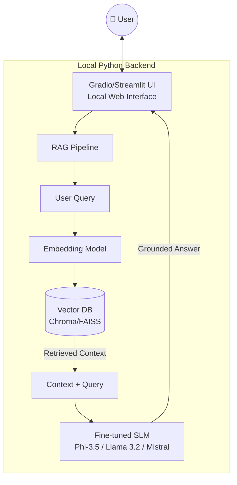

7Building domain-specialized SLMs like a "Mini-Lawyer" or "Local Doctor" for private, local RAG systems is a highly strategic project. Here is your complete, step-by-step technical blueprint to do just that.

---

🎯 1. Model Selection: Your Specialized Base

Choosing the right base model is the most critical first step for building a high-performing domain-specialized SLM. Based on current evaluations and benchmarks, here are the top recommendations for 2026:

Feature Phi-3.5-Mini Llama 3.2 3B Llama 3.1 8B Mistral-7B
Parameters 3.8B 3B 8B 7B
Best For RAG, long-context, doc-heavy General chat, fine-tuning Generalist, strong fine-tuning RAG, legal/medical fine-tuned
License MIT (permissive) Llama 3 Community Llama 3 Community Apache 2.0
Hardware (4-bit) 6-10GB RAM < 6GB RAM ~6GB VRAM ~6GB VRAM

For your specific needs:

· For the "Local Doctor": Consider the specialized Phi-3-Mini (3.8B). It achieves a 69% score on the MMLU benchmark, surpassing much larger models like Mixtral 8x7B, thanks to its high-quality, textbook-style training data. Its ability to maintain 92% answer consistency when questioned from different angles on a 50-page document is ideal for detailed clinical notes. As an alternative, Mistral-7B is also a proven choice, with a case study showing a RAG pipeline built around it cut clinical rule creation time by over 97%.
· For the "Mini-Lawyer": Mistral-7B is an excellent choice. The llmware/dragon-mistral-7b-v0 model is already fine-tuned specifically for fact-based QA over complex legal documents, achieving a 96.5% accuracy score on a RAG benchmark without hallucinations. As a compelling alternative, consider the Qwen2.5-7B or Qwen3-8B, which are noted for their excellent performance-to-parameter ratio and specialized capabilities. A fine-tuned 8B model can achieve an F1 score of 0.89 on legal contract review, outperforming general-purpose 70B models.

Sovereignty First: All recommended models are open-weight, allowing you to download, fine-tune, and run them entirely on your own infrastructure.

---

⚙️ 2. Fine-Tuning Implementation: Injecting Expertise

Data: The Foundation of Your Model

The quality of your dataset is the single most important factor. You can source data from the following:

· Medical Domain: MedDialog (3.4M real doctor-patient dialogues), cMedQA2 (100K+ medical Q&As), ChatDoctor (5.4K structured cases), or the MPCCD-MLF dataset.
· Legal Domain: LegalBench (162 tasks), CaseHOLD, ContractNLI, or the Legal RAG Bench dataset.
· Synthetic Data: Generate your own using LLMs to augment existing data, which can help with privacy preservation.

For a high-quality model, aim for 5,000 to 20,000+ high-quality, instruction-formatted pairs.

The Fine-Tuning Pipeline with QLoRA

Parameter-Efficient Fine-Tuning (PEFT), specifically QLoRA (Quantized Low-Rank Adaptation), is the industry standard for fine-tuning models on consumer hardware. It dramatically reduces memory usage while maintaining performance. The complete pipeline involves:

1. Load 4-bit Base Model: Use bitsandbytes to quantize the model.
2. Configure LoRA Adapters: Define target modules and rank (r=16 or 32).
3. Train with Transformers: Leverage Hugging Face libraries.
4. Merge & Export: Combine the adapter with the base model.

To get you started quickly, I've put together a complete Google Colab notebook that implements this full pipeline:

<CodeSplittable>

```python
# @title ⚕️ Mini-Lawyer & Local Doctor: Domain-Specialized SLM Fine-tuning
# @markdown Run this cell to set up the environment and fine-tune your model.

!pip install -q unsloth transformers datasets peft accelerate bitsandbytes

from unsloth import FastLanguageModel
import torch
from transformers import TrainingArguments
from trl import SFTTrainer
from datasets import Dataset

# -------------------------------
# ⚙️ 1. Configuration
# -------------------------------
# @markdown ### Model & Hardware
MODEL_NAME = "microsoft/Phi-3.5-mini-instruct" # @param ["microsoft/Phi-3.5-mini-instruct", "meta-llama/Llama-3.2-3B-Instruct", "mistralai/Mistral-7B-Instruct-v0.3"]
MAX_SEQ_LENGTH = 2048
LORA_R = 16
LORA_ALPHA = 32
LORA_DROPOUT = 0.1

# @markdown ### Hyperparameters
OUTPUT_DIR = "./fine_tuned_model"
NUM_EPOCHS = 3
BATCH_SIZE = 4
LEARNING_RATE = 2e-4

# -------------------------------
# 🏗️ 2. Load Model & Tokenizer
# -------------------------------
model, tokenizer = FastLanguageModel.from_pretrained(
    model_name = MODEL_NAME,
    max_seq_length = MAX_SEQ_LENGTH,
    load_in_4bit = True,
)

model = FastLanguageModel.get_peft_model(
    model,
    r = LORA_R,
    lora_alpha = LORA_ALPHA,
    lora_dropout = LORA_DROPOUT,
    target_modules = ["q_proj", "k_proj", "v_proj", "o_proj",
                      "gate_proj", "up_proj", "down_proj",],
    bias = "none",
    use_gradient_checkpointing = True,
)

# -------------------------------
# 🗂️ 3. Load & Format Dataset
# -------------------------------
# @markdown ### Replace with your medical/legal dataset
dataset = Dataset.from_dict({
    "instruction": ["Explain the legal concept of 'consideration' in a contract."],
    "output": ["Consideration is something of value exchanged between parties..."]
})

def format_instruction(example):
    return {"text": f"<|user|>\n{example['instruction']}\n<|assistant|>\n{example['output']}<|endoftext|>"}

dataset = dataset.map(format_instruction)

# -------------------------------
# 🚀 4. Train with SFTTrainer
# -------------------------------
trainer = SFTTrainer(
    model = model,
    tokenizer = tokenizer,
    train_dataset = dataset,
    args = TrainingArguments(
        per_device_train_batch_size = BATCH_SIZE,
        gradient_accumulation_steps = 4,
        warmup_steps = 5,
        num_train_epochs = NUM_EPOCHS,
        learning_rate = LEARNING_RATE,
        fp16 = not torch.cuda.is_bf16_supported(),
        bf16 = torch.cuda.is_bf16_supported(),
        logging_steps = 1,
        optim = "adamw_8bit",
        output_dir = OUTPUT_DIR,
    ),
)
trainer.train()

# -------------------------------
# 💾 5. Merge & Save Model
# -------------------------------
model.save_pretrained_merged(OUTPUT_DIR, tokenizer, save_method = "merged_4bit")
```

</CodeSplittable>

For advanced domain adaptation, you can also explore continued pre-training on domain-specific corpora (e.g., medical journals, legal case law) before the fine-tuning stage.

---

🔍 3. RAG Implementation: The External Brain

RAG provides your model with the ability to ground its answers in your proprietary documents. The system works by converting user questions into numerical vectors (embeddings) to find relevant documents, then passing both the query and retrieved text to the LLM to generate a grounded answer.

Step 1: Choose Your Embedding Model

The retrieval quality depends heavily on your embedding model.

· Jina Embeddings v4 (3.8B): An excellent open-source choice, supporting text, images, and PDFs with MRL compression for efficient storage.
· BAAI/bge-m3: A very strong performer for retrieval-focused applications across many languages.

Step 2: Set Up the Vector Database

```python
import chromadb
from sentence_transformers import SentenceTransformer

embedding_model = SentenceTransformer('BAAI/bge-m3')
client = chromadb.PersistentClient(path="./law_db")
collection = client.get_or_create_collection("legal_docs")

# Index documents
collection.add(
    documents=["Your document text here..."],
    ids=["doc_id_1"],
    embeddings=embedding_model.encode(["Your document text here..."]).tolist()
)

# Query
query = "What are the key elements of a non-disclosure agreement?"
query_embedding = embedding_model.encode(query).tolist()
results = collection.query(query_embeddings=[query_embedding], n_results=5)
```

Step 3: Advanced RAG Pipeline

A production-grade RAG pipeline involves more than just retrieving a few chunks.

· Chunking Strategy: For complex legal or medical documents, a semantic chunking strategy works best. Overlapping chunks by 10-20% ensures no information is lost at the boundaries.
· Prompt Engineering: Use a specific prompt that instructs the model to ground its answer in the provided context and cite its sources.
· Self-RAG: Implement a loop where the model assesses whether the retrieved context is sufficient to answer the query. If not, it can trigger a new, refined search.

---

📊 4. Evaluation: Measure, Validate, Iterate

You can't improve what you don't measure. Use the following benchmarks to validate your models:

· For Medical QA: MedRGB is the most comprehensive framework, evaluating the model's robustness, ability to handle noise in retrieved documents, and correct information integration. A well-tuned RAG system can achieve 89.0% extraction accuracy, compared to 62.6% for a standalone LLM.
· For Legal QA: LegalBench includes 162 tasks for different types of legal reasoning. The Legal RAG Bench dataset is specifically designed for this task.

When evaluating your models, focus on domain-specific metrics like Source Citation Accuracy for both models, Hallucination Rate, and task-specific metrics like F1 score for legal classification or BLEU score for medical Q&A.

---

🚀 5. Deployment: Bringing It All Together

For true data sovereignty, deployment must be entirely local.

· GGUF & llama.cpp: Convert your fine-tuned model to GGUF format and deploy using llama.cpp. This highly optimized C++ implementation allows you to run powerful LLMs efficiently on CPUs or consumer GPUs.
· Ollama: The easiest way to get started. You can create a Modelfile to import your fine-tuned GGUF model and run it with a single command.
· Full-Stack Application: Build a complete, private RAG application using the following architecture:



💡 Pro Tip: For maximum security, run the entire backend in a containerized environment (e.g., Docker) with no network egress to ensure no data ever leaves your local machine.

---

✨ Summary: Your Path to AI Sovereignty

Building sovereign SLMs is a three-phase journey:

1. Choose Wisely: Select the right base model for your task (Mistral-7B for law, Phi-3.5-Mini for medicine, Llama-3.2-3B for general use).
2. Fine-Tune Efficiently: Use QLoRA on a high-quality, domain-specific dataset of 5K-20K examples.
3. Ground & Deploy: Build a robust RAG pipeline with a strong embedding model and deploy it entirely on your own infrastructure using llama.cpp or Ollama.

By following this blueprint, you can create "Mini-Lawyer" and "Local Doctor" chat assistants that are not only highly capable but also secure, private, and truly sovereign.